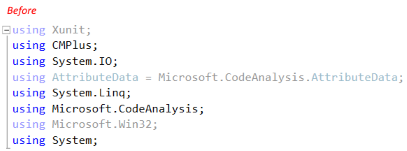
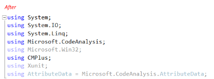

# CodeMaid+

This simple extension is an attempt to address some shortcomings of rather excellent code formatting extension [CodeMaid](http://www.codemaid.net/). The best outcome is achieved when it is used (integrated) with CodeMaid even though it can be used on its own.

## Problem

One of the most popular and versatile coding assistance solution, ReSharper, has a fundamental flaw. Its outdated formatting strategy is extremely aggressive and very often stays on the way of being productive. Thus it does not support some modern syntax paradigms nor allow applying styles in a less aggressive way. Basically when it comes to formatting this great product becomes rather stubborn.

The problem has been consistently reported to (and acknowledged by) JetBrains since as early as 10-15 years ago. Though their support always reject any need for improvement. If you google you will be able to find the threads where ReSHarper support simply advise the users to stop using ReSharper formatting if they don't like it as is.  

For people who don't want to give up on ReSharper and yet demand more than its can do for formatting the solution can be to use it in conjunction with CodeMaid. CodeMaid is specifically developed as a versatile formatting solution thus it can be used in conjunction with ReSharper. CodeMaid for formatting and ReSharper for everything else.  

This approach usually works for me very well. However due to the more liberal nature of the formatting algorithm (something that makes CodMaid so great) it can leave some formatting artefacts that need to be addressed manually.

This extension is an attempt to address these CodeMaid shortcomings by extending CodeMaid functionality with additional formatting algorithms that are automatically invoked during CodeMaid cleaning/formatting execution. 
You just need to configure CodeMaid to invoke _CodeMaid+_ during cleanup (see _**Installation**_ section)
## Solution

The following formatting actions are performed during _CodeMaid+_ execution:

### Sorting using statements 
CodeMaid invokes Visual Studio own 'remove and sort using statements'. If it is done on saving the document it can lead to the accidental loss of some of them. The problem is that VS does both removal and sorting. CodeMaid.Plus fixes this problem by not removing unused usings but still sorting and removing duplicates:

### Fluent is not aligned
CodeMaid/VS more relaxed indentation for fluent API is great but it may get accidentally misaligned and not even gain the first level of indent. CodeMaid+ fixes it by ensuring at lease one level of indentation:

In case of more canonical Fluent pattern the original indentation stays untouched.

### XML Documentation block may contain trailing blank line

A simple problem that is just overlooked by CodeMaid.

## Installation

Install the extension from Visual Studio Market place and configure it to be invoked during CodeMaid cleanup by placing the command `Tools.CM+Format` in the _CodeMaid > Options > Reorganizing > ThirdParty > Other Cleaning Commands_:

 

## Conclusion

This solution is an open end effort and it can grow in additional functionality if the need arises. On the other hand, it may be short lived if CodeMaid address its problems natively.

